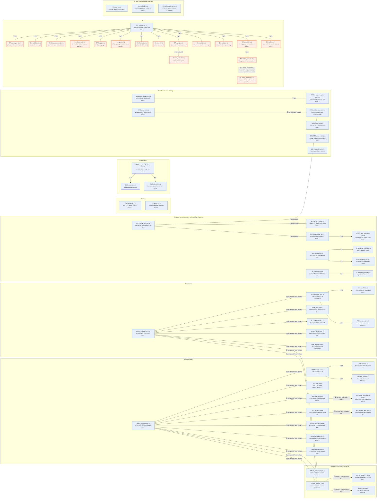

# Full-text assessment: branching logic

Generated by `notebooks/06_full_text_assessment_codebook.ipynb` from the codebook xlsx. Single boxes are paper-level, double boxes dataset-level.

```mermaid
flowchart LR
  subgraph CLI["Climate"]
    CLI_domain["CLI.domain <small>(CLI.1)</small><br/><small>What is the climate domain? (e.g., cl…</small>"]
    CLI_focus["CLI.focus <small>(CLI.2)</small><br/><small>Is a climate subject the main focus o…</small>"]
  end
  subgraph MIS["Misinformation"]
    MIS_is_present["MIS.is_present <small>(MIS.1)</small><br/><small>Is misinformation present? It is cons…</small>"]
    MIS_has_def["MIS.has_def <small>(MIS.2)</small><br/><small>Is there a definition of misinformati…</small>"]
    MIS_def["MIS.def <small>(MIS.3)</small><br/><small>What definition of misinformation doe…</small>"]
    MIS_def_src["MIS.def_src <small>(MIS.4)</small><br/><small>What is the source of the definition?…</small>"]
    MIS_type["MIS.type <small>(MIS.5)</small><br/><small>What is the type of misinformation? (…</small>"]
    MIS_agents["MIS.agents <small>(MIS.6)</small><br/><small>Which agents of misinformation are me…</small>"]
    MIS_agent_identification["MIS.agent_identification <small>(MIS.7)</small><br/><small>How are the agents identified? (How d…</small>"]
    MIS_metrics["MIS.metrics <small>(MIS.8)</small><br/><small>What metrics are reported? (How do th…</small>"]
    MIS_metrics_desc["MIS.metrics_desc <small>(MIS.9)</small><br/><small>Cite any relevant descriptions of the…</small>"]
    MIS_truth_status["MIS.truth_status <small>(MIS.10)</small><br/><small>How is truth status established? (e.g…</small>"]
    MIS_responses["MIS.responses <small>(MIS.11)</small><br/><small>Are responses to misinformation prese…</small>"]
    MIS_findings["MIS.findings <small>(MIS.12)</small><br/><small>What are the findings regarding misin…</small>"]
  end
  subgraph POL["Polarization"]
    POL_is_present["POL.is_present <small>(POL.1)</small><br/><small>Is polarization present? It is consid…</small>"]
    POL_has_def["POL.has_def <small>(POL.2)</small><br/><small>Is there a definition of polarization?</small>"]
    POL_def["POL.def <small>(POL.3)</small><br/><small>What definition of polarization does …</small>"]
    POL_def_src["POL.def_src <small>(POL.4)</small><br/><small>What is the source of the definition?…</small>"]
    POL_type["POL.type <small>(POL.5)</small><br/><small>What is the type of polarization? (e.…</small>"]
    POL_measure["POL.measure <small>(POL.6)</small><br/><small>How is polarization measured?</small>"]
    POL_findings["POL.findings <small>(POL.7)</small><br/><small>What are the findings regarding polar…</small>"]
    POL_change["POL.change <small>(POL.8)</small><br/><small>What is the change in polarization?</small>"]
  end
  subgraph MP["Intersection (Misinfo. and Polar.)"]
    MP_rel_measured["MP.rel_measured <small>(MP.1)</small><br/><small>What relationship between misinformat…</small>"]
    MP_rel_claimed["MP.rel_claimed <small>(MP.2)</small><br/><small>What relationship between misinformat…</small>"]
    MP_rel_evidence["MP.rel_evidence <small>(MP.3)</small><br/><small>What evidence does the paper offer in…</small>"]
    MP_rel_cite["MP.rel_cite <small>(MP.4)</small><br/><small>Cite the text stating the concluding …</small>"]
  end
  subgraph MOT["Motivations, methodology, actionability, alignment"]
    MOT_motiv_cite["MOT.motiv_cite <small>(MOT.1)</small><br/><small>What are the motivation(s) of the stu…</small>"]
    MOT_motiv_cat["MOT.motiv_cat <small>(MOT.2)</small><br/><small>Under which categories do those motiv…</small>"]
    MOT_motiv_clear["MOT.motiv_clear <small>(MOT.3)</small><br/><small>Is there a clear motivation in terms …</small>"]
    MOT_motiv_clear_cite["MOT.motiv_clear_cite <small>(MOT.4)</small><br/><small>Which passage states it? Cite and/or …</small>"]
    MOT_theory["MOT.theory <small>(MOT.5)</small><br/><small>Is there a theoretical basis for the …</small>"]
    MOT_theory_why["MOT.theory_why <small>(MOT.6)</small><br/><small>Why? Cite and/or explain.</small>"]
    MOT_validation["MOT.validation <small>(MOT.7)</small><br/><small>What type of validation was used?</small>"]
    MOT_action["MOT.action <small>(MOT.8)</small><br/><small>Is the methodology actionable? (“Acti…</small>"]
    MOT_action_why["MOT.action_why <small>(MOT.9)</small><br/><small>Why? Cite and/or explain.</small>"]
  end
  subgraph STAK["Stakeholders"]
    STAK_are_stakeholders["STAK.are_stakeholders <small>(STAK.1)</small><br/><small>Are stakeholders (e.g., fact checkers…</small>"]
    STAK_who["STAK.who <small>(STAK.2)</small><br/><small>Who are the stakeholders?</small>"]
    STAK_cite["STAK.cite <small>(STAK.3)</small><br/><small>Which passage evidences this? Cite it.</small>"]
  end
  subgraph CON["Conclusions and findings"]
    CON_concl["CON.concl <small>(CON.1)</small><br/><small>What are the conclusions of the study…</small>"]
    CON_concl_clear["CON.concl_clear <small>(CON.2)</small><br/><small>Is there a clear conclusion in terms …</small>"]
    CON_concl_clear_cite["CON.concl_clear_cite <small>(CON.3)</small><br/><small>Which passage states it? Cite and/or …</small>"]
    CON_motiv_match["CON.motiv_match <small>(CON.4)</small><br/><small>Do the motivations and conclusions ma…</small>"]
    CON_limits["CON.limits <small>(CON.5)</small><br/><small>What are the limitations of the study…</small>"]
    CON_STEM_hum["CON.STEM_hum <small>(CON.6)</small><br/><small>Overall, to which research area do th…</small>"]
    CON_subfield["CON.subfield <small>(CON.7)</small><br/><small>Report any relevant subfield</small>"]
  end
  subgraph DA["Data"]
    DA_is_data["DA.is_data <small>(DA.1)</small><br/><small>Does the study uses at least one data…</small>"]
    DA_data_type[["DA.data_type <small>(DA.2)</small><br/><small>What kind of data do they use?</small>"]]
    DA_modality[["DA.modality <small>(DA.3)</small><br/><small>What is the modality?</small>"]]
    DA_dataset_name[["DA.dataset_name <small>(DA.4)</small><br/><small>What is the name of the dataset?</small>"]]
    DA_platform[["DA.platform <small>(DA.5)</small><br/><small>From which platform was the data retr…</small>"]]
    DA_lang[["DA.lang <small>(DA.6)</small><br/><small>In which language?</small>"]]
    DA_geo[["DA.geo <small>(DA.7)</small><br/><small>Which geographic location does the da…</small>"]]
    DA_theme[["DA.theme <small>(DA.8)</small><br/><small>What is the thematic?</small>"]]
    DA_new[["DA.new <small>(DA.9)</small><br/><small>Is it a new dataset?</small>"]]
    DA_size[["DA.size <small>(DA.10)</small><br/><small>What is the size of the dataset?</small>"]]
    DA_size_unit[["DA.size_unit <small>(DA.11)</small><br/><small>In which unit is the size expressed?</small>"]]
    DA_start[["DA.start <small>(DA.12)</small><br/><small>What is the time span starting?</small>"]]
    DA_end[["DA.end <small>(DA.13)</small><br/><small>What is the time span ending?</small>"]]
    DA_annot[["DA.annot <small>(DA.14)</small><br/><small>Did they perform annotations or produ…</small>"]]
    DA_annot_who[["DA.annot_who <small>(DA.15)</small><br/><small>Who performed the annotations?</small>"]]
    DA_annot_model[["DA.annot_model <small>(DA.16)</small><br/><small>How were LLMs or other models used fo…</small>"]]
    DA_task[["DA.task <small>(DA.17)</small><br/><small>What is the ML task the dataset is in…</small>"]]
  end
  subgraph ML["ML and computational methods"]
    ML_task["ML.task <small>(ML.1)</small><br/><small>Which ML task(s) do they tackle?</small>"]
    ML_method["ML.method <small>(ML.2)</small><br/><small>Which computational method do they us…</small>"]
    ML_subtechnique["ML.subtechnique <small>(ML.3)</small><br/><small>Which ML subtechniques or frameworks …</small>"]
  end
  MIS_is_present -->|"∈ yes, direct / yes, indirect"| MIS_has_def
  MIS_has_def -->|"= yes"| MIS_def
  MIS_has_def -->|"= yes"| MIS_def_src
  MIS_is_present -->|"∈ yes, direct / yes, indirect"| MIS_type
  MIS_is_present -->|"∈ yes, direct / yes, indirect"| MIS_agents
  MIS_agents -->|"∉ NA / not reported / unclear"| MIS_agent_identification
  MIS_is_present -->|"∈ yes, direct / yes, indirect"| MIS_metrics
  MIS_metrics -->|"∉ not reported / unclear / NA"| MIS_metrics_desc
  MIS_is_present -->|"∈ yes, direct / yes, indirect"| MIS_truth_status
  MIS_is_present -->|"∈ yes, direct / yes, indirect"| MIS_responses
  MIS_is_present -->|"∈ yes, direct / yes, indirect"| MIS_findings
  POL_is_present -->|"∈ yes, direct / yes, indirect"| POL_has_def
  POL_has_def -->|"= yes"| POL_def
  POL_has_def -->|"= yes"| POL_def_src
  POL_is_present -->|"∈ yes, direct / yes, indirect"| POL_type
  POL_is_present -->|"∈ yes, direct / yes, indirect"| POL_measure
  POL_is_present -->|"∈ yes, direct / yes, indirect"| POL_findings
  POL_is_present -->|"∈ yes, direct / yes, indirect"| POL_change
  POL_is_present -->|"∈ yes, direct / yes, indirect"| MP_rel_measured
  MIS_is_present -->|"∈ yes, direct / yes, indirect"| MP_rel_measured
  POL_is_present -->|"∈ yes, direct / yes, indirect"| MP_rel_claimed
  MIS_is_present -->|"∈ yes, direct / yes, indirect"| MP_rel_claimed
  MP_rel_claimed -->|"∉ unclear / not reported / NA"| MP_rel_evidence
  MP_rel_claimed -->|"∉ unclear / not reported / NA"| MP_rel_cite
  MOT_motiv_cite -->|"≠ not reported"| MOT_motiv_cat
  MOT_motiv_cite -->|"≠ not reported"| MOT_motiv_clear
  MOT_motiv_clear -->|"= yes"| MOT_motiv_clear_cite
  MOT_theory -->|"≠ 0"| MOT_theory_why
  MOT_theory -->|"= 4"| MOT_validation
  MOT_action -->|"≠ 0"| MOT_action_why
  STAK_are_stakeholders -->|"≠ 0"| STAK_who
  STAK_are_stakeholders -->|"≠ 0"| STAK_cite
  CON_concl_clear -->|"= yes"| CON_concl_clear_cite
  MOT_motiv_cite -->|"≠ not reported"| CON_motiv_match
  CON_concl -->|"∉ not reported / unclear"| CON_motiv_match
  DA_is_data -->|"= yes"| DA_data_type
  DA_is_data -->|"= yes"| DA_modality
  DA_is_data -->|"= yes"| DA_dataset_name
  DA_is_data -->|"= yes"| DA_platform
  DA_is_data -->|"= yes"| DA_lang
  DA_is_data -->|"= yes"| DA_geo
  DA_is_data -->|"= yes"| DA_theme
  DA_is_data -->|"= yes"| DA_new
  DA_is_data -->|"= yes"| DA_size
  DA_size -->|"≠ not reported"| DA_size_unit
  DA_is_data -->|"= yes"| DA_start
  DA_is_data -->|"= yes"| DA_end
  DA_is_data -->|"= yes"| DA_annot
  DA_annot -->|"= yes"| DA_annot_who
  DA_annot_who -->|"∈ LLM or generative mod… / non-generative classi…"| DA_annot_model
  DA_is_data -->|"= yes"| DA_task
  classDef dataset fill:#fdeee7,stroke:#eb6834
  classDef paper fill:#e8f1fb,stroke:#2a78d6
  class DA_data_type,DA_modality,DA_dataset_name,DA_platform,DA_lang,DA_geo,DA_theme,DA_new,DA_size,DA_size_unit,DA_start,DA_end,DA_annot,DA_annot_who,DA_annot_model,DA_task dataset
  class CLI_domain,CLI_focus,MIS_is_present,MIS_has_def,MIS_def,MIS_def_src,MIS_type,MIS_agents,MIS_agent_identification,MIS_metrics,MIS_metrics_desc,MIS_truth_status,MIS_responses,MIS_findings,POL_is_present,POL_has_def,POL_def,POL_def_src,POL_type,POL_measure,POL_findings,POL_change,MP_rel_measured,MP_rel_claimed,MP_rel_evidence,MP_rel_cite,MOT_motiv_cite,MOT_motiv_cat,MOT_motiv_clear,MOT_motiv_clear_cite,MOT_theory,MOT_theory_why,MOT_validation,MOT_action,MOT_action_why,STAK_are_stakeholders,STAK_who,STAK_cite,CON_concl,CON_concl_clear,CON_concl_clear_cite,CON_motiv_match,CON_limits,CON_STEM_hum,CON_subfield,DA_is_data,ML_task,ML_method,ML_subtechnique paper
```
